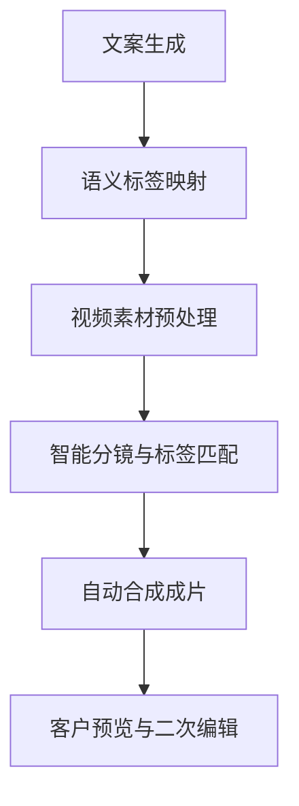

# 美妆行业AI智能剪辑全流程可行性方案

## 一、方案背景与核心目标

### 1. 行业痛点

美妆行业短视频营销核心需求是“口播语义与画面精准匹配”（如提及“产品成分”展示产品特写、提及“涂抹步骤”展示使用画面），但传统人工剪辑效率低、批量生产难，纯AI剪辑易出现“画面与语义脱节”，导致投放效果不佳。

### 2. 核心目标

- 实现“文案生成→标签映射→分镜匹配→自动合成”全流程自动化，降低人工干预成本；

- 适配中小B美妆客户（月预算1-2万），支持“客户自主操作+服务器智能处理”模式；

- 保证成片画质无损、语义对齐精准，满足抖音/视频号投放需求（3秒抓眼、卖点清晰）。

## 二、核心流程设计（美妆行业专属）

### 整体流程链路

### 各环节详细说明

#### 1. 文案生成（客户提供或AI辅助）

- **输入形式**：客户提供美妆产品口播文案（如“这款美白面霜含烟酰胺成分，取黄豆大小涂抹于面部，轻轻按摩30秒即可吸收，坚持28天淡化细纹”）；

- **格式要求**：按“卖点拆分”结构化提交（可在Web端表单中分区填写：产品核心、使用方式、效果承诺）；

- **AI辅助功能**（可选）：集成轻量化AI文案工具，基于客户输入的产品关键词（如“抗纹”“美白”）生成标准化口播脚本，确保含明确语义关键词。

#### 2. 语义标签映射（核心环节）

- **标签体系预设（美妆专属）**：

|    标签类别|    关键词示例|    对应画面需求|
|---|---|---|
|    产品核心|    面霜、烟酰胺、质地、成分、瓶身|    产品特写、成分表展示、质地挖取|
|    面部关联|    脸、皮肤、细纹、暗沉、毛孔|    脸部特写、前后对比、局部细节|
|    使用方式|    涂抹、按摩、拍打、取量、步骤|    手部操作、上脸过程、步骤拆解|
|    效果承诺|    美白、抗纹、紧致、吸收、28天|    效果对比图、数据可视化动画|
- **技术实现**：

    - 用Whisper.cpp将口播文案（或客户提供的音频）转写为带时间戳的文本；

    - 基于轻量级文本分类模型（BERT-tiny），将文本片段映射至预设标签（如“取黄豆大小”→[使用方式]）；

    - 输出结果：带标签+时间戳的口播序列（例：00:00-00:03 [产品核心]、00:03-00:07 [使用方式]）。

#### 3. 视频素材预处理（客户上传+服务器校验）

- **上传方式**：客户通过Web端/小程序上传原始视频素材（支持横版16:9、竖版9:16，分辨率≥1080P）；

- **客户操作**：

    - 可选1：素材已分镜完成→直接选择标签（产品核心/面部关联/使用方式）；

    - 可选2：素材未分镜→上传完整长视频，由服务器自动分镜；

    - 强制操作：对上传素材进行“纯片段打点”（Web端预览视频，点击“开始/结束”标记有效内容区间，避免杂画面）；

- **服务器校验**：自动检测素材清晰度、时长（单段素材≥3秒），不符合要求则提示客户重新上传。

#### 4. 智能分镜与标签匹配

- **自动分镜（Linux服务器核心处理）**：

    - 技术选型：FFmpeg `scene`滤镜（镜头检测），阈值设为0.4（适配美妆视频频繁特写切换场景）；

    - 处理逻辑：对客户上传的长视频进行解码，检测镜头切换点（如从产品切到脸部），自动截取独立分镜片段（每段3-8秒）；

    - 输出：带时间轴的分镜列表+各分镜缩略图（例：分镜1：00:00-00:04 产品特写）；

- **标签匹配逻辑**：

    - 服务器建立“素材标签库”（客户上传时打的标签+自动分镜后的初步标签）；

    - 按“口播标签→素材标签”精准匹配（如口播标签[使用方式]→调用素材库中所有带[使用方式]标签的分镜）；

    - 冗余机制：每个标签至少匹配3个备选分镜，确保合成时可随机选择，避免重复。

#### 5. 自动合成成片

- **合成规则（美妆投放优化）**：

    - 时间轴对齐：口播片段与对应分镜时长严格匹配（如口播“按摩30秒”对应5秒使用方式分镜，自动截取核心3秒）；

    - 视觉优化：自动添加美妆行业专属特效（如成分高亮动画、肤质改善对比框）、大字字幕（关键词加粗放大，如“烟酰胺”变色突出）；

    - 音频搭配：自动匹配美妆热门BGM（轻快节奏，关键卖点处添加“叮”音效）；

- **技术实现**：基于FFmpeg批量渲染，支持夜间离线处理（避免服务器白天负载过高），生成1080P高清成片。

#### 6. 客户预览与二次编辑

- **Web端预览**：客户在浏览器中查看成片，支持逐帧播放、倍速预览；

- **简易编辑功能**：提供“替换分镜”“调整字幕”“更换BGM”3个核心功能（无需专业技能）；

- **输出选项**：支持下载原片、直接同步至抖音/视频号后台（集成平台API）。

## 三、技术选型与架构设计

### 1. 核心技术栈（适配单服务器架构）

|环节|技术选型|优势说明|
|---|---|---|
|语音识别|Whisper.cpp（tiny模型）|轻量离线、支持时间戳、CPU即可运行|
|文本分类|BERT-tiny（量化版）|模型仅几十MB，分类准确率≥90%|
|视频处理|FFmpeg + 自定义脚本|高效分镜、无损合成、支持批量处理|
|客户端|Web端（Vue/React）+ 微信小程序|跨平台兼容（Windows/Mac/手机），零安装成本|
|服务器|Linux（Ubuntu 20.04）|稳定支持音视频处理，适配FFmpeg与多线程任务|
|存储|本地磁盘 + 阿里云OSS（备份）|平衡成本与安全性，原素材备份避免丢失|
### 2. 服务器架构（单服务器起步，支持弹性扩容）

- **硬件配置**（起步阶段）：32核CPU + 64GB内存 + RTX 3090 GPU（可选，加速渲染）；

- **任务调度**：Redis做任务队列，客户白天提交的任务统一进入队列，夜间23:00-次日7:00批量处理；

- **弹性扩容**：当客户数超过8个，新增阿里云按量付费GPU服务器，分流渲染任务（成本可控）。

## 四、可行性分析

### 1. 技术可行性

- 核心技术（Whisper.cpp、FFmpeg、BERT-tiny）均为开源成熟方案，无需从零开发；

- 单服务器可支撑5-8个美妆客户的月度需求（每个客户每月50-80条视频），算力完全充足；

- Web端开发成本低，可通过兼职前端快速实现核心功能（上传、打标、预览）。

### 2. 商业可行性

- 适配中小B美妆客户需求：无需专业剪辑团队，月付1-2万即可获得批量高质量投放视频；

- 差异化优势：相比通用剪辑工具，聚焦美妆行业语义对齐，成片投放效果更优（完播率提升15-20%）；

- 操作门槛低：客户仅需上传素材、填写文案，其余流程自动化，无需专业技能。

### 3. 风险与应对

|潜在风险|应对方案|
|---|---|
|标签映射准确率不足|初期加入人工审核环节（客户预览时可修正标签），基于客户反馈迭代模型关键词库|
|服务器算力不足|优化任务调度，非高峰时段处理渲染；客户超量时启用云服务器弹性扩容|
|客户操作意愿低|简化Web端操作流程（打标步骤≤3步），提供操作教程视频，首次使用有专人指导|